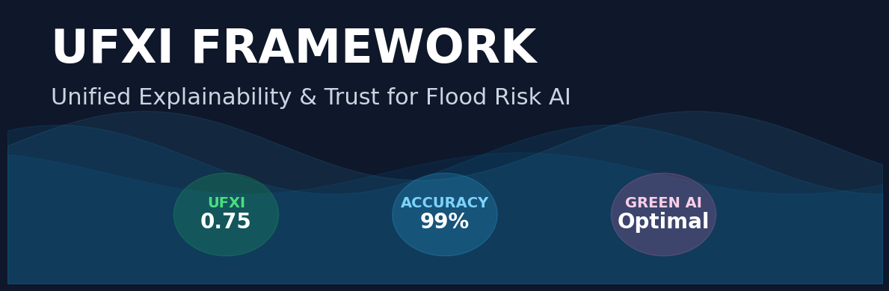

<div align="center">
  
</div>

# UFXI: A Unified Explainability and Trust Framework for Machine Learning-Based Flood Risk Prediction


**Author:** Md Naeem Sheikh  
**Contact:** https://www.linkedin.com/in/md-naeem-sheikh  
**License:** MIT License  
**Status:** Research Completed (2025)

---

## **Abstract**

Machine learning models can achieve strong performance in hydrological forecasting, but their “black box” behavior limits transparency in operational decision-making. This project introduces the **Unified Flood Explainability Index (UFXI)**—a structured metric for evaluating the trustworthiness of machine learning explanations used in flood prediction models.

The framework integrates global, local, interaction-based, and counterfactual explainability methods, along with sensitivity checks and stratified evaluation on high-risk disaster cases. Advanced ensemble architectures such as CatBoost, XGBoost, and Stacking models were benchmarked on a real-world flood dataset.

---

## **Key Contributions**

### 🔹 1. Unified Flood Explainability Index (UFXI)
A quantitative metric combining:
- Explanation Fidelity  
- Stability under noise  
- Cross-method Agreement  
- Feature Sparsity  
- Counterfactual Realism  

### 🔹 2. Multi-Level Explainability Pipeline
Includes SHAP, LIME, feature interactions, ALE, PDP, and counterfactual reasoning.

### 🔹 3. High-Risk Disaster Analysis
Performance validated specifically for high-probability flood events (> 0.55).

### 🔹 4. Actionable Counterfactual Policies
Automated generation of "what-if" recommendations to support risk mitigation.

### 🔹 5. Green AI Comparison
Accuracy vs. computational cost evaluated using AIC.

---

## **Results Overview**

| Metric | Linear Baseline | Stacking Ensemble | CatBoost (Proposed) |
|-------|-----------------|------------------|----------------------|
| **Global R²** | 1.00 | 0.88 | **0.99** |
| **High-Risk RMSE** | 0.0000 | 0.0078 | **0.0041** |
| **AIC Score** | –107,746 | –14,208 | **–16,046** |

**Summary:**  
CatBoost provides the best balance of accuracy, parsimony, and reliability for flood-risk prediction.

---

## **UFXI Performance**

| Component | Score | Description |
|----------|--------|-------------|
| **Fidelity** | 1.00 | Explanations perfectly reconstruct predictions. |
| **Stability** | 0.90 | Interpretation is robust to noise. |
| **Realism** | 0.90 | Counterfactual suggestions remain feasible. |
| **Agreement** | 0.57 | Moderate consistency across XAI methods. |
| **Sparsity** | 0.15 | Flood risk is inherently multifactorial. |

**Final UFXI Score:** **0.75**

---

---

## **Installation & Usage**

### **1. Install dependencies**
```bash
pip install -r requirements.txt

2. Launch Jupyter Notebook
jupyter notebook

3. Open the notebook
FloodXAI_UFXI.ipynb

Citation
If you use this framework, please cite:

Sheikh, M. N. (2025).
UFXI: A Unified Explainability and Trust Framework for Machine Learning-Based Flood Risk Prediction.
GitHub Repository.

License
This project is released under the MIT License.
You may use, modify, and distribute this work with attribution.


